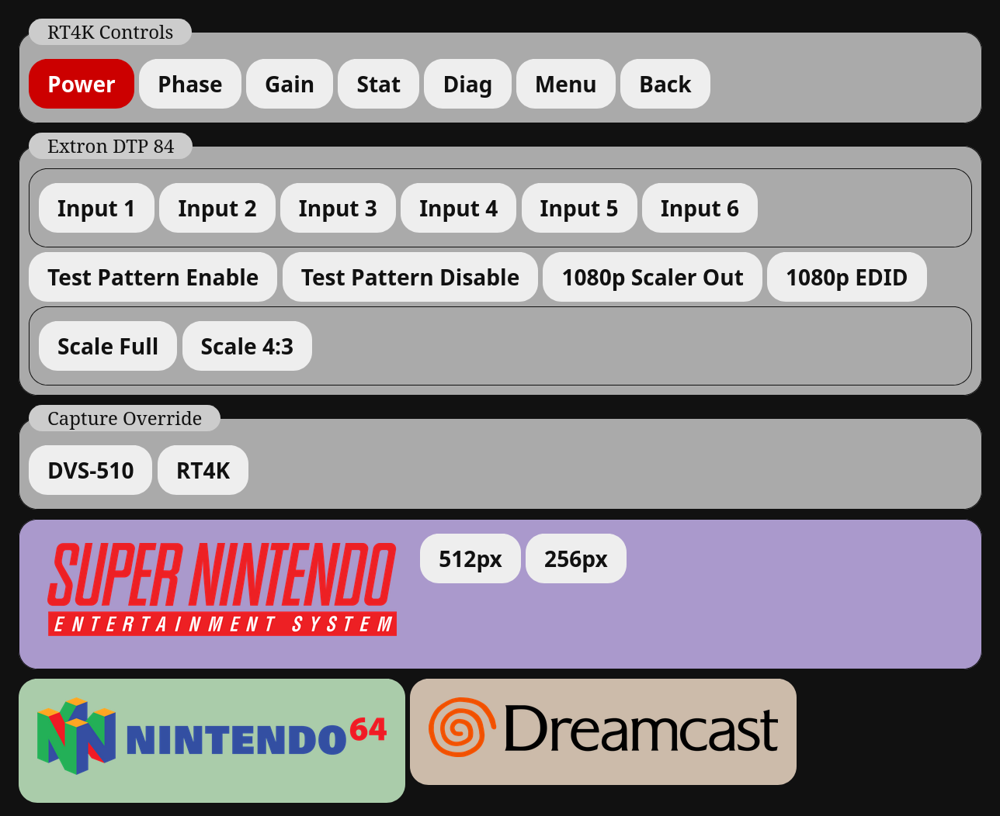
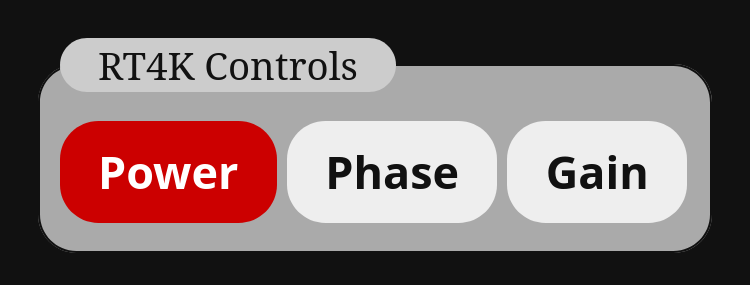

# Video Route
A multi-device video processor controller for remotely configuring and using switchers, scalers, OBS, and more over a simple web front end.

## Documentation

- **[Controllers](doc/Controllers.md)**
- - **[Retrotink 4K](doc/Controller-RT4K.md)**
- **[Sources](doc/Sources.md)**  

## Demo

See [config-sample.json](config-sample.json) for how this demo is implemented.

## Usage Example

You will need to create a JSON configuration file the details how to access your devices and the buttons and commands you want to be able to execute on it. For example, if you have a Retrotink 4K you will need to configure it as a serial device.

     "video_controllers":{
        "rt4k":{
            "name":"Retrotink 4K",
            "type":"serial",
            "baud":115200,
            "parity":"N",
            "serial":"FT232R USB UART - FT232R USB UART",
            "cmd_delay":0,
            "line_end":"\n"
        }

Then you can configure `sources` for it and create a group of buttons for basic functions.

    "sources":{
        "rt4k":{
            "name":"RT4K Controls",
            "sources":{
                "rt4k-power":{
                    "name":"Power",
                    "color":"#FFF",
                    "background":"#c00",
                    "rt4k":["remote pwr","pwr on"]
                    },
                "rt4k-phase":{
                    "name":"Phase",
                    "rt4k":["remote phase"]
                    },
                "rt4k-gain":{
                    "name":"Gain",
                    "rt4k":["remote gain"]
                    }
                }
            }
        }

This would look like [this exmple file](doc/examples/rt4k.json) when done and would produce a page that looks like the following:

Clicking any of the three buttons would access the video controller defined as `rt4k` and send it the commands in the list.

## More
The demo above uses the [Platform Logos redrawn by Dan Patrick](https://forums.launchbox-app.com/files/file/3402-v2-platform-logos-professionally-redrawn-official-versions-new-bigbox-defaults/) and are highly recommended for use with this program.