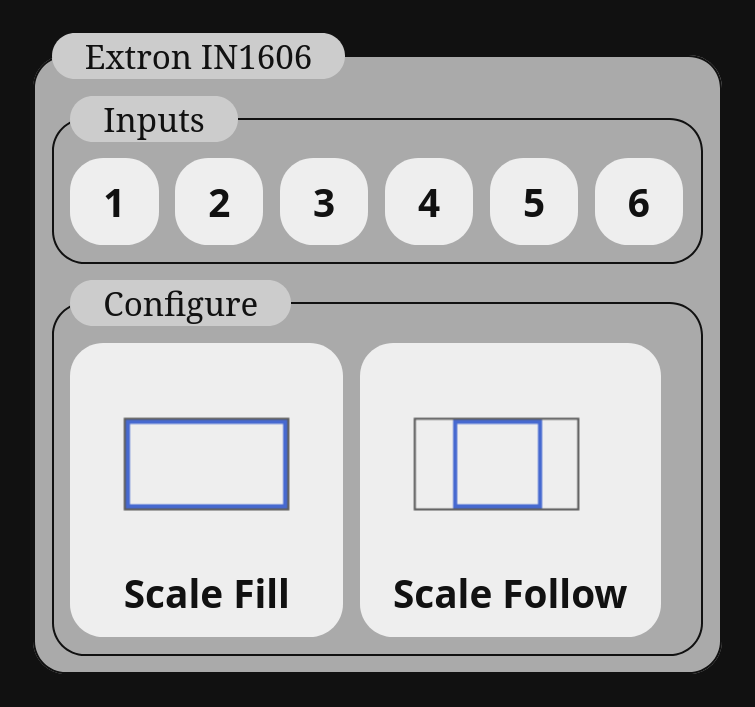

# Extron Usage

Extron is a major manufacturer of video equipment for commercial broadcast use. It's hardware has been around for decades and mostly all uses a similar command set known as SIS. SIS commands are independent of the interface. One piece of hardware may support RS-232, HTTP, and Telnet interfaces. It depends on how they are configured and the model.

The following is an example of how to configure and use an Extron IN1606 with this software. You can view the full [example JSON](examples/extron.json) for this as well.

## Controller Configuration
You can access an IN1606 using the following configuration options over telnet.

    "video_controllers":{
        "in1606":{
                "name":"Extron IN1606",
                "type":"telnet",
                "connection_skip":3,
                "ip":"192.168.0.144",
                "cmd_delay":0.05
            }
    }

*In this case the key `in1606` will be used to send commands to this device from sources.*

You may wish to change the `cmd_delay` parameter to wait between commands. I find it can help if you are using auto image.

## Telnet Interface

If you are using a telnet interface the operation of the remote control works a little differently from what you may expect. Telnet is a remote terminal interface meant for interactive command lines. As such Extron devices typically print back information. For example, when you first connect, the following is sent by an IN1606

    .
    (c) Copyright 2019, Extron Electronics, IN1606, V2.38, 60-1081-01
    Tue, 13 Jan 2026 12:16:10

*Note, the period on the first line is not sent, a fully blank line is sent instead.*

This information is irrelevant for the purposes of this application, the `connection_skip` parameter is used to tell the software to discard a number lines of initial responses. You may want to connect to your equipment with a traditional telnet client first to ensure you have the right options for the connection.

One final important thing, telnet relies heavily on the usage of the `[Esc]` character. This character cannot be represented in JSON natively. If you want to put an `[Esc]` character into a command, put `#ESC` instead and the software will substitute it before the command is run. Any further references to the `[Esc]` character in this will use the `#ESC` version as that is all that is applicable to this software.

### Authentication

The Extrons can have a password system set up to access the hardware. I haven't tested this, but you most likely can add the password as a command before the commands you want to send. A future version of this program may support a command prefix list to automate login by storing credentials in the video controller definition.

An FYI, the commands listed in the configuration JSON file are *not* rendered to the web page. So a password stored there would not be visible to front end users.

## Common SIS Commands

Many commands are identical between Extron units which makes configuration easy if you have learned how to use one. Not all of these are guaranteed to be supported by every device but they are fairly common.

### Common command concepts

- **Input Selection and Matrix Ties** [`1!`,`1*2!`] : Selecting sources and outputs is a two part command, first the numbers for the input (and output) and either a `!`,`&`, or `$` for *Video and Audio*, Video only, and Audio only respectively. Ties between inputs and outputs on matrix switchers use an asterisk (`*`) in between the input and output numbers.
- - `!` : Select or tie **Video and Audio**
- - `&` or `%` : Select or tie **Video only**
- - `$` : Select or tie **Audio only**
- **Auto Image** : Automatically adjusting the image can be enabled with `{#}*1A` and disabled with `{#}*0A` where `{#}` is the input number. When enabled the following commands perform different kinds of auto image adjustments.
- - `1*A`: Auto image and stretch input to fill output frame
- - `2*A`: Auto image and scale input to fill inner bounds of output frame maintaining the original aspect ratio
- **Preset loading and saving** : Instead of programming all image adjustments into this software you can store a preset in the hardware. Presets are *much* faster and are highly recommended. The following commands load and save presets.
- - `1*{#}.` : Load preset number `{#}` from memory
- - `1*{#},` : Save preset number `{#}` to memory
- **Image Adjustments** : There are a number of image adjustment options that come in three versions `#ESC{#}CMD` to set directly to value `{#}`, `#ESC+CMD` to increase, and `#ESC-CMD` to decrease. The following options replace `CMD` to configure different settings. *(Note, if you have a multi-output device, put the output number after the `#ESC` and a `*` before a direct value.)*
- - `COLR` : Color
- - `TINT` : Tint
- - `CONT` : Contrast
- - `BRIT` : Brightness
- - `HDET` : Detail/sharpness
- - `HCTR` : Horizontal Shift (Center)
- - `VCTR` : Vertical Shift (Center)
- - `HSIZ` : Horizontal Size
- - `VSIZ` : Vertical Size
- - `ZOOM` : Zoom
- - `HPAN` : Horizontal Pan
- - `VPAN` : Vertical Pan
- **Compound Size and Position** : Some scalers support combining some of the above commands to set the H/V Position and Size in a single command. 
- - `#ESC{HCTR}*{VCTR}*{HSIZ}*{VSIZ}XIMG` : Place the direct values you want to set for the `{CMD}` in place of the respective values using the legend above.
- - `#ESC{#},{HCTR}*{VCTR}*{HSIZ}*{VSIZ}XIMG` : The same as the above command but for multi-output scalers has the output number after the `#ESC`.

### Additional

If you are using a device like the IN1606 that takes different kinds of analog input types on a single RGB input. You will need to know the `Input video format` command for your device and the values that represent the different supported format. These will be completely different for each device.

There are some matrix switchers like the MPX 866 that feature two discrete maxtrixes. The two matrixes cannot have video cross between them but audio can and they share the same input and output sequence numbers. As a safeguard, you tie low number inputs with video and audio using `!` like normal, but tie high number video and audio ties are done with `%`.

## Source Commands

Here is how a basic input selection could be done with the Extron commands.

    "extron":{
        "name":"Extron IN1606 Inputs",
        "sources":{
            "input-1":{
                "name":"1",
                "in1606":["1!"]
                },
            "input-2":{
                "name":"2",
                "in1606":["2!"]
                },
            "input-3":{
                "name":"3",
                "in1606":["3!"]
                }
            }
        }

A more advanced sequence of commands could load a preset after switching if you know what the signal will be beforehand.

    "in1606":["1!","1*1."]

Here is an example using some of the built in icons to represent the different fill and follow image functions.
        
        "configure":{
            "name":"Configure",
            "sources":{
                "scale-wide":{
                    "name":"Scale Fill",
                    "icon":"wide",
                    "in1606":["1*A"]
                    },
                "scale-follow":{
                    "name":"Scale Follow",
                    "icon":"full",
                    "in1606":["2*A"]
                    }
            }
        }

## Full Example

The following is the full configuration file for the example image at the top of this page. You can also view the full [example JSON](examples/extron.json) for this as well.

    {
    "video_controllers":{
        "in1606":{
                "name":"Extron IN1606",
                "type":"telnet",
                "connection_skip":3,
                "ip":"192.168.0.144",
                "cmd_delay":0.05
            }
    },
    "sources":{
        "extron":{
            "name":"Extron IN1606",
            "sources":{
                "inputs":{
                    "name":"Inputs",
                    "sources":{
                        "input-1":{
                            "name":"1",
                            "in1606":["1!"]
                            },
                        "input-2":{
                            "name":"2",
                            "in1606":["2!"]
                            },
                        "input-3":{
                            "name":"3",
                            "in1606":["3!"]
                            },
                        "input-4":{
                            "name":"4",
                            "in1606":["4!"]
                            },
                        "input-5":{
                            "name":"5",
                            "in1606":["5!"]
                            },
                        "input-6":{
                            "name":"6",
                            "in1606":["6!"]
                            }
                        }
                    },

                "configure":{
                    "name":"Configure",
                    "sources":{
                        "scale-wide":{
                            "name":"Scale Fill",
                            "icon":"wide",
                            "in1606":["1*A"]
                            },
                        "scale-follow":{
                            "name":"Scale Follow",
                            "icon":"full",
                            "in1606":["2*A"]
                            }
                    }
                }
            }
        }

    }
    }

