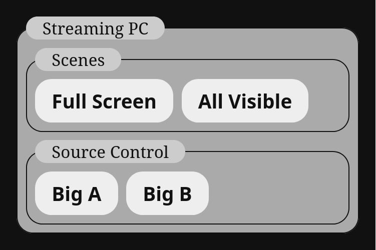

# OBS Usage

OBS uses WebSockets for remote control. This program uses the [`obsws-python`](https://pypi.org/project/obsws-python/1.1.0/) python module to interface but it doesn't prevent you from needed to know the [WebSocket API](https://github.com/obsproject/obs-websocket/blob/master/docs/generated/protocol.md#setcurrentprogramscene).

The following is an example of how to configure and use OBS with this software. You can view the full [example JSON](examples/obs.json) for this and import a [Scene Collection](examples/obs-scene_collection.json) to test it as well.

## Controller Configuration
You can access an OBS using the following configuration options.

    "video_controllers":{
        "stream-pc":{
            "name":"Streaming Computer",
            "type":"obs",
            "timeout":3,
            "password":"LMQY85v3ZT4cLzWk",
            "ip":"127.0.0.1",
            "port":"4455"
        }
    }

*In this case the key `stream-pc` will be used to send commands to this device from sources.*

## Simple Commands

[`obsws-python`](https://pypi.org/project/obsws-python/1.1.0/) exposes WebSocket commands as Python functions. This software allows you to use dictionaries to express function calls in the JSON files. The key is the name of the function and the value should be a list containing parameter values.

As a simplified example, a source that would call `print("Hello!")` would look like this:

    "sources":{
        "fake-print":{
            "name":"Print Hello!",
            "not-a-controller":[
                    {
                        "print":["Hello!"]
                    }
                ]
            }
    }

Now to use this for OBS, lets say you want a source to switch a scene. The official WebSocket control for that is [SetCurrentProgramScene](https://github.com/obsproject/obs-websocket/blob/master/docs/generated/protocol.md#setcurrentprogramscene). That control is wrapped as the function [set_current_program_scene](https://github.com/aatikturk/obsws-python/blob/main/obsws_python/reqs.py#L558) in `obsws-python`. If your scene was named "Full Screen" you can use the following source command to change to it:

    "full-screen":{
        "name":"Full Screen",
        "stream-pc":[
            {
                "set_current_program_scene":["Full Screen"]
            }
        ]
    }

## Compound Commands

Simple commands can have all of their needed parameters stored directly in the list. Compound commands require data from the OBS Websocket API to be able to work. In order to handle these commands this program allows you to put a function in a parameter list and it will use the return value as the parameter. Functions can be indefinitely nested like this.

For example, lets say you want to set the visibility of an item. The official WebSocket control for that is [SetSceneItemEnabled](https://github.com/obsproject/obs-websocket/blob/master/docs/generated/protocol.md#setsceneitemenabled). That control is wrapped as the function [set_scene_item_enabled](https://github.com/aatikturk/obsws-python/blob/main/obsws_python/reqs.py#L1453) in `obsws-python`. `set_scene_item_enabled` requires the **ID** of an item, not the name. In order to get the ID, we need to query it with [GetSceneItemId](https://github.com/obsproject/obs-websocket/blob/master/docs/generated/protocol.md#getsceneitemid) as [get_scene_item_id](https://github.com/aatikturk/obsws-python/blob/main/obsws_python/reqs.py#L1513). This takes the *name of the scene* (or group!) the item is in as well as *the name of the item* and returns the value of it in an object with the item ID in the attribute `scene_item_id`. 

### Return Attribute Selection
If you know the returned value will only have a single attribute you can pass it directly and this program will find it automatically. But if you want to manually specify the attribute to use or if it returns multiple and you need to pick one, you can put a function call into a dictionary and use the key as the attribute name.

This means to set an item's visibility, we need to get the ID, then pass that as a parameter. Here is what that looks like for a source named `Camera Source` in a scene named `Inputs` and manually specifying the return attribute to use:

    "camera-enable":{
        "name":"Show Camera",
        "stream-pc":[
            {                                      # Begin item enable function
                "set_scene_item_enabled":          # Item enable function name
                [                                  # Item enable function parameters
                    "Inputs",                      # Item enable scene
                    {                              # Begin item id get function
                        "scene_item_id":{          # Return object parameter
                            "get_scene_item_id":   # ID get function name
                            [                      # ID get function parameters
                                "Inputs",          # ID get scene
                                "Camera Source"    # ID get item name
                            ]
                        }
                    },
                    true                           # Item enable boolean
                ]
            }
        ]
    }

*Note: Comments aren't valid in JSON, these are for the benefit of understanding this example **only**.*

Yes, it has to be **that complicated**. I don't really fault OBS for this, you can have some phenomenally complicated scene layouts and handling that isn't easy.

## Full Example

The following example is a full implementation of switching between two cameras and two scenes, it will render the demo image shown at the top of this page. You can view the full [example JSON](examples/obs.json) for this and import a [Scene Collection](examples/obs-scene_collection.json) to test it as well. Remember to enable WebSockets and change the password to match what your OBS instance expects.

    {
    "video_controllers":{
            "stream-pc":{
                "name":"Streaming Computer",
                "type":"obs",
                "timeout":3,
                "password":"LMQY85v3ZT4cLzWk",
                "ip":"127.0.0.1",
                "port":"4455"
            }
    },
    "sources":{
        "rt4k":{
            "name":"Streaming PC",
            "sources":{
                "scenes":{
                    "name":"Scenes",
                    "sources":{
                        "full-screen":{
                            "name":"Full Screen",
                            "stream-pc":[{"set_current_program_scene":["Full Screen"]}]
                            },
                        "all-visible":{
                            "name":"All Visible",
                            "stream-pc":[{"set_current_program_scene":["All Visible"]}]
                            }
                        }
                    },
                "source-control":{
                    "name":"Source Control",
                    "sources":{
                        "cam-en":{
                            "name":"Big A",
                            "stream-pc":[
                                {
                                    "set_scene_item_enabled":[
                                        "BigSource",
                                        {"scene_item_id":{"get_scene_item_id":[
                                            "BigSource",
                                            "Cam B"
                                        ]}},
                                        false
                                ]},
                                {
                                    "set_scene_item_enabled":[
                                        "BigSource",
                                        {"scene_item_id":{"get_scene_item_id":[
                                            "BigSource",
                                            "Cam A"
                                        ]}},
                                        true
                                ]},
                                {
                                    "set_scene_item_enabled":[
                                        "Small View",
                                        {"scene_item_id":{"get_scene_item_id":[
                                            "Small View",
                                            "Cam A"
                                        ]}},
                                        false
                                ]},
                                {
                                    "set_scene_item_enabled":[
                                        "Small View",
                                        {"scene_item_id":{"get_scene_item_id":[
                                            "Small View",
                                            "Cam B"
                                        ]}},
                                        true
                                ]}
                            ]
                        },
                        "cam-dis":{
                            "name":"Big B",
                            "stream-pc":[
                                {
                                    "set_scene_item_enabled":[
                                        "BigSource",
                                        {"scene_item_id":{"get_scene_item_id":[
                                            "BigSource",
                                            "Cam A"
                                        ]}},
                                        false
                                ]},
                                {
                                    "set_scene_item_enabled":[
                                        "BigSource",
                                        {"scene_item_id":{"get_scene_item_id":[
                                            "BigSource",
                                            "Cam B"
                                        ]}},
                                        true
                                ]},
                                {
                                    "set_scene_item_enabled":[
                                        "Small View",
                                        {"scene_item_id":{"get_scene_item_id":[
                                            "Small View",
                                            "Cam A"
                                        ]}},
                                        true
                                ]},
                                {
                                    "set_scene_item_enabled":[
                                        "Small View",
                                        {"scene_item_id":{"get_scene_item_id":[
                                            "Small View",
                                            "Cam B"
                                        ]}},
                                        false
                                ]}
                            ]
                        }
                    }
                }
            }
        }

    }
    }
