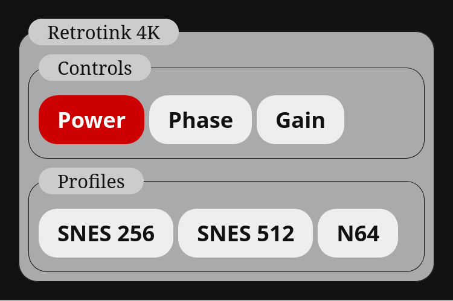

# Retrotink 4k Usage

The Retrotink 4k is an analog to digital video scaler with a highly configurable settings. Setting presets can be saved as profiles and loaded via commands that will set inputs and scaler settings.

The following is an example of how to configure and use the RT4K with this software. You can view the full [example JSON](examples/rt4k.json) for this as well.

## Controller Configuration
You can access an RT4K using the following configuration options.

    "video_controllers":{
        "rt4k-example":{
            "name":"Retrotink 4K",
            "type":"serial",
            "baud":115200,
            "parity":"N",
            "serial":"FT232R USB UART - FT232R USB UART",
            "cmd_delay":0,
            "line_end":"\n"
        }
    }

*In this case the key `rt4k-example` will be used to send commands to this device from sources.*

You may wish to change the `cmd_delay` parameter to wait between commands but in my experience it hasn't been needed.

## Commands

You can find a list of all serial commands for the RT4K on the [consolemods wiki](https://consolemods.org/wiki/AV:RetroTINK-4K#Remote_Control_Commands). The normal commands directly map to buttons on the remote. Rather than mapping every button in the video routing manager, you may be interested in [my RT4K web remote](https://github.com/AkBKukU/rt4k-remote). For this I would recommend sticking to commands like phase, gain, and profiles that intantly perform a single action. You can also turn the RT4K on and off with serial commands, you can make one button do both by sending `remote pwr` followed by `pwr on` which will work as a toggle.

Here is what a group of source buttons for Power, Phase, and Gain would look like:

    "sources":{
        "rt4k-power":{
            "name":"Power",
            "rt4k-example":["remote pwr","pwr on"]
            },
        "rt4k-phase":{
            "name":"Phase",
            "rt4k-example":["remote phase"]
            },
        "rt4k-gain":{
            "name":"Gain",
            "rt4k-example":["remote gain"]
            }
        }
    }

### SVS Commands

The RT4K supports special commands from the [SVS](https://scalablevideoswitch.com/) which is meant to sync profiles with active inputs. We can abuse these commands though to load an arbitrary number of profiles directly from files. Ensure the **Auto Load SVS** setting in the **Profiles** menu of the RT4K is set to **On**.

SVS profiles need to be stored under `profile/svs` on the RT4K SD Card. Profile files must be prefixed with `S`, a number for an input, and then `_`. The rest of the file can be named however you want before ending in `.rt4k`. The input number does not need to be zero prefixed. The command to load these files is `SVS NEW INPUT=` followed by the input number. The following are examples commands and the files they will load:

- `SVS NEW INPUT=10` : S10_SNES-256.rt4
- `SVS NEW INPUT=12` : S12_N64.rt4
- `SVS NEW INPUT=200` : S200_D_TinyPentium.rt4

A note, the consolemods wiki states you need to continously run `SVS CURRENT INPUT=` after `SVS NEW INPUT=`. This **is not needed**, and only running `SVS NEW INPUT=` will work perfectly fine.

With all that, you can make profile switching sources in the following way:

    "sources":{
        "svs-10":{
            "name":"SNES 256",
            "rt4k-example":["SVS NEW INPUT=10"]
            },
        "svs-11":{
            "name":"SNES 512",
            "rt4k-example":["SVS NEW INPUT=11"]
            },
        "svs-12":{
            "name":"N64",
            "rt4k-example":["SVS NEW INPUT=12"]
            }
        }
    }

## Full Config File

Putting it all together using source groups we can generate the front end shown in the image above with the following JSON, which you can also [find here](examples/rt4k.json).

    {
    "video_controllers":{
        "rt4k-example":{
            "name":"Retrotink 4K",
            "type":"serial",
            "baud":115200,
            "parity":"N",
            "serial":"FT232R USB UART - FT232R USB UART",
            "cmd_delay":0,
            "line_end":"\n"
        }
    },
    "sources":{
        "rt4k":{
            "name":"Retrotink 4K",
            "sources":{
                "rt4k-buttons":{
                    "name":"Controls",
                    "sources":{
                        "rt4k-power":{
                            "name":"Power",
                            "color":"#FFF",
                            "background":"#c00",
                            "rt4k-example":["remote pwr","pwr on"]
                            },
                        "rt4k-phase":{
                            "name":"Phase",
                            "rt4k-example":["remote phase"]
                            },
                        "rt4k-gain":{
                            "name":"Gain",
                            "rt4k-example":["remote gain"]
                            }
                        }
                    },

                "rt4k-profiles":{
                    "name":"Profiles",
                    "sources":{
                        "svs-10":{
                            "name":"SNES 256",
                            "rt4k-example":["SVS NEW INPUT=10"]
                            },
                        "svs-11":{
                            "name":"SNES 512",
                            "rt4k-example":["SVS NEW INPUT=11"]
                            },
                        "svs-12":{
                            "name":"N64",
                            "rt4k-example":["SVS NEW INPUT=12"]
                            }
                        }
                    }
                }
            }
        }
    }

You'll notice that the `rt4k-buttons` and `rt4k-profiles` groups are used to structure the interface. The `rt4k-power` source also has color options defined to make the button red. You can find more info about that in the full [Sources Documentation](./Sources.md).
